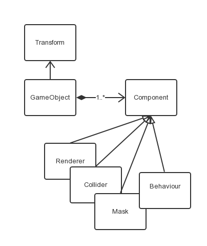

# WOZLLA.js

**WOZLLA.js** is a JavaScript/TypeScript 2D Game Engine, it aims to provide a complete solution for HTML5
games creation. It uses WebGL for 2D rendering and is NOT compatible with Canvas2D.

## Getting Started

```javascript
// create director and start main loop
var director = new WOZLLA.Director(document.getElementById('canvas'));
director.start();

// new a GameObject
var gameObj = new WOZLLA.GameObject();
// create a sprite renderer
var spriteRenderer = new WOZLLA.component.SpriteRenderer();
// set image src
spriteRenderer.imageSrc = 'images/panda.png';
// add to gameObj
gameObj.addComponent(spriteRenderer);

// this would automatically load all assets of gameObj, children and children's children.
gameObj.loadAssets(function() {
    // init gameObj
    gameObj.init();
    // add to stage
    director.stage.addChild(gameObj);
});
```

## Core Architecture



## Current Features

Version 1.0 (Released)

* WebGL Rendering
* GameObject and Component
* Transform and Tween
* Event System
* Touch Input
* Graphics: Sprite/NinePatch/Mask
* Animation: DragonBones
* UI widget: Button/CheckBox
* Automatically Assets Management

## API References
[API References](http://zzm2q.github.io/WOZLLA.js/docs/api/template.html)


## Change Logs

* add ScrollRect

* Version 1.0 (Released)
* add AnimationRenderer
* add simple primitives: RectRenderer, CircleRenderer
* add TextRenderer
* add a base class: CanvasRenderer
* Auto Assets Management

* Version 0.5.1 (Released)

## RoadMap

Version 1.5
* Stability Optimization
* Sound System
* More UI components

Version 2.0
* Enhance the JSON file of GameObject structure, so users could simply build a GameObject tree with JSON files.
* Provide an Editor for visual editing


## Bug Reporting

Please report [issues](https://github.com/wozlla/WOZLLA.js/issues) with as much info as possible.

## Thanks

The parts of technologies WOZLLA.js using was learn from the following libraries:

* [pixi.js](https://github.com/GoodBoyDigital/pixi.js)
* [createjs](https://github.com/CreateJS)

## MIT License

The MIT License (MIT)

Copyright (c) 2014-2015 Wozlla

Permission is hereby granted, free of charge, to any person obtaining a copy
of this software and associated documentation files (the "Software"), to deal
in the Software without restriction, including without limitation the rights
to use, copy, modify, merge, publish, distribute, sublicense, and/or sell
copies of the Software, and to permit persons to whom the Software is
furnished to do so, subject to the following conditions:

The above copyright notice and this permission notice shall be included in all
copies or substantial portions of the Software.

THE SOFTWARE IS PROVIDED "AS IS", WITHOUT WARRANTY OF ANY KIND, EXPRESS OR
IMPLIED, INCLUDING BUT NOT LIMITED TO THE WARRANTIES OF MERCHANTABILITY,
FITNESS FOR A PARTICULAR PURPOSE AND NONINFRINGEMENT. IN NO EVENT SHALL THE
AUTHORS OR COPYRIGHT HOLDERS BE LIABLE FOR ANY CLAIM, DAMAGES OR OTHER
LIABILITY, WHETHER IN AN ACTION OF CONTRACT, TORT OR OTHERWISE, ARISING FROM,
OUT OF OR IN CONNECTION WITH THE SOFTWARE OR THE USE OR OTHER DEALINGS IN THE
SOFTWARE.